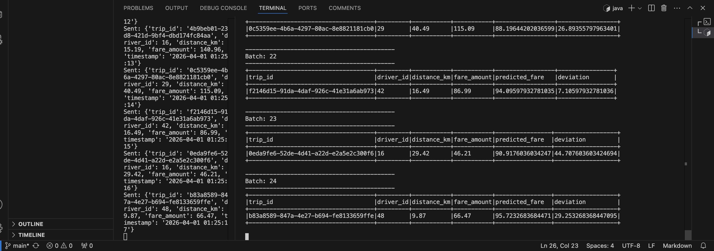
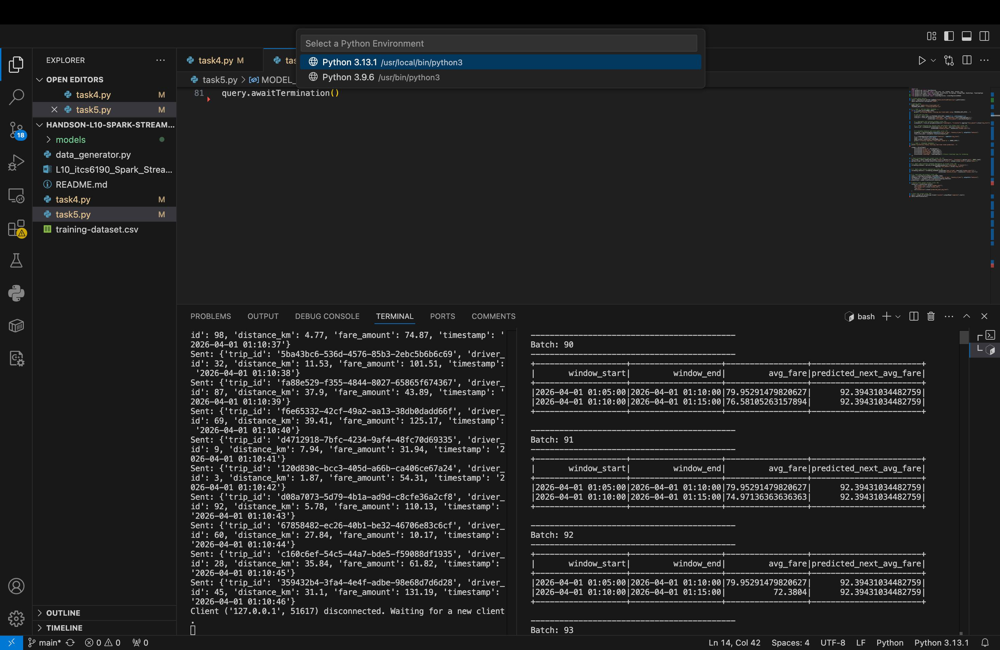

# Handson-L10-Spark-Streaming-MachineLearning-MLlib
Ride-Sharing Fare and Trend Prediction
This project uses Apache Spark Structured Streaming and MLlib to analyze ride-sharing data in real-time. I built two different models: one to predict individual trip fares and another to predict pricing trends over time.

# Procedure
1. Real-Time Fare Prediction (Task 4)
Goal: Predict how much a ride should cost based on its distance.

# How it works: 
I trained a Linear Regression model using the distance_km column.

Streaming: When new ride data comes in, the model predicts the fare. I also added a "deviation" column to show the difference between the actual price and what the model predicted. This helps find "surge" prices or errors.

# Results:

2. Time-Based Trend Prediction (Task 5)
Goal: Predict the average fare for a specific 5-minute window.

# How it works: 
I grouped the data into 5-minute blocks. I used the "hour of the day" and "minute of the hour" as features to train a second model.

Streaming: The system looks at the current time and predicts what the average fare trend will be for the next window.

# Results:

# How to Run the Code
Start the Data Generator:
python3 data_generator.py

Run Task 4:
spark-submit task4.py

Run Task 5:
spark-submit task5.py

# Project Structure
task4.py: Script for individual fare predictions.

task5.py: Script for 5-minute windowed trend predictions.

models/: Folder containing the saved machine learning models.

training-dataset.csv: The data used to train the models.
